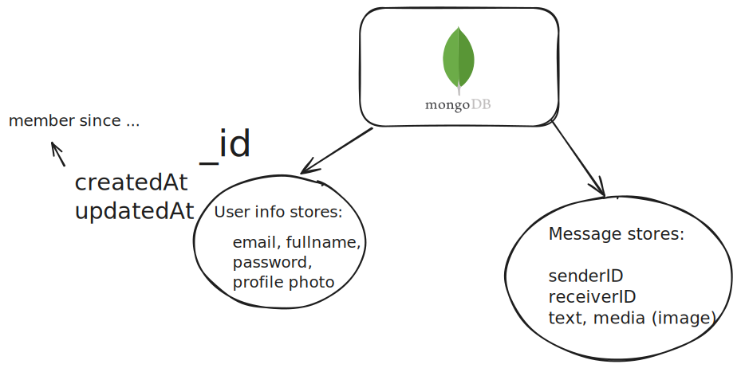
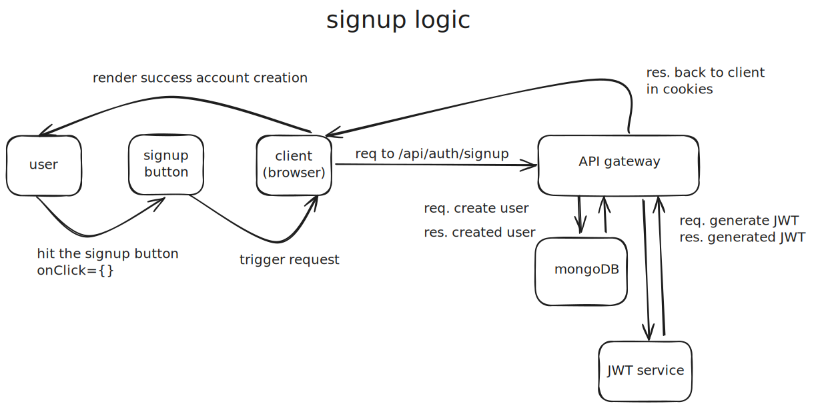

# This is FatChat

a responsive real-time chatting application using ReactJS, Express, Socket.io, Zustand, MongoDB, Cloudinary

### what & how user & text data is stored

#### I2I (Issues & To-Improves)

- [ ] at profile page, once uploading avatar results a new avatar in cloudinary, improving this by replacing the old avatar by the latest uploaded one!
- [ ] at login page, implement user forgot password case via email

#### on-going add-on features:

- generate & scanning QR code to search account profile in additions to via email address searching
- adding speech-to-text feature on conversation chat
- allowing users to exchange voice-chat in additions to text & image
- enable user to flexibly change their email associated with current account (suggestions: generate unchangeable unique id for each account instance/requiring user to put preferred username when signup)
- allow user to delete chat conversations
- adding group chat feature to allow multiple users send chat messages in one conversation
